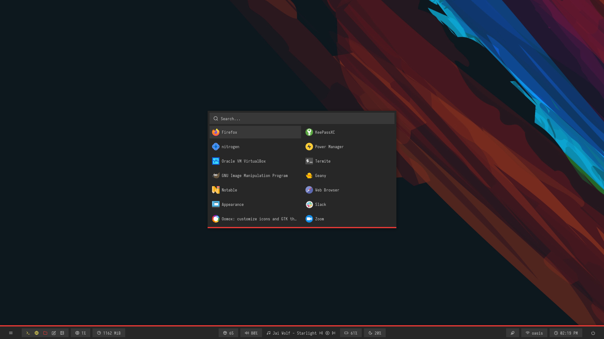
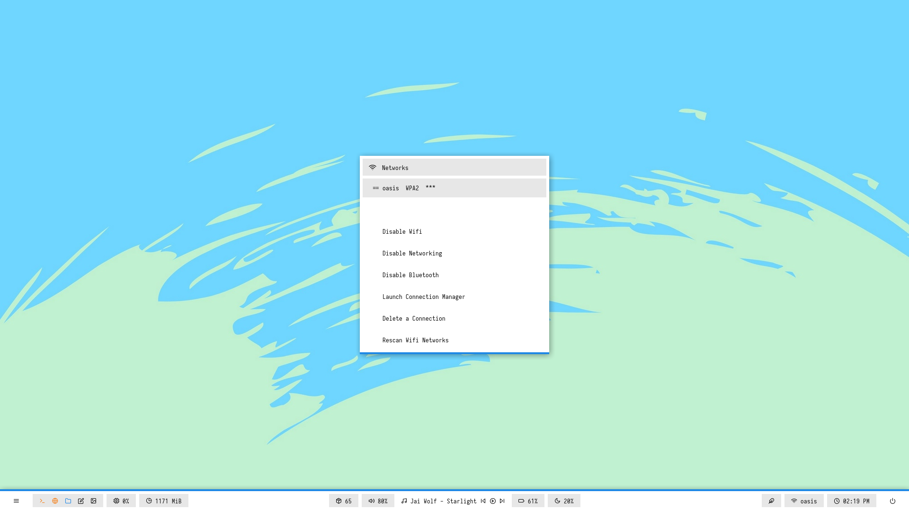
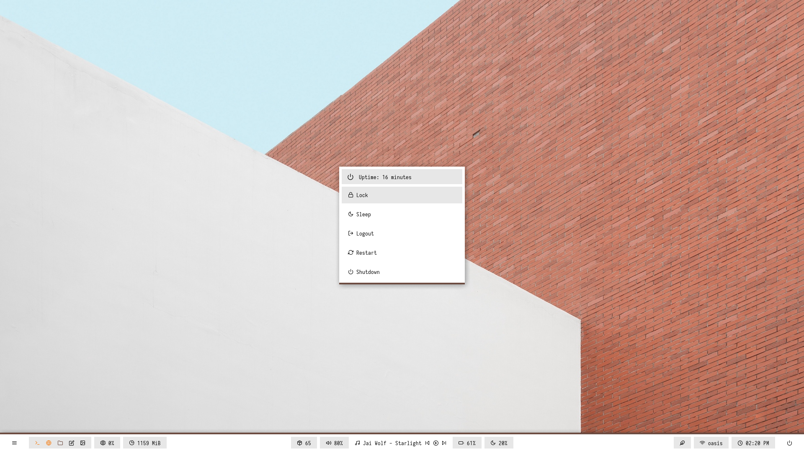
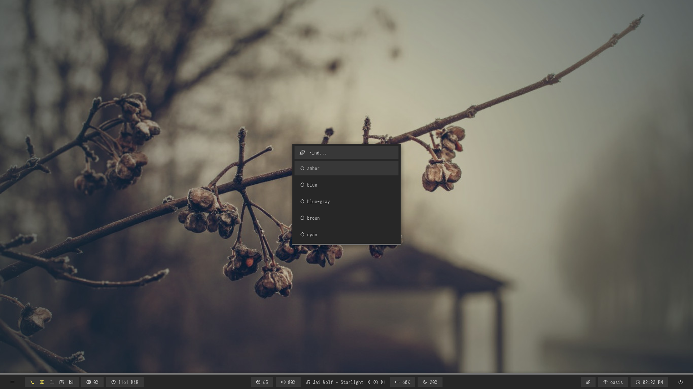

# ~/.dotfiles


<details>
<summary><b>Rofi & Desktop</b></summary>

|Launcher|Networks|
|--|--|
|||

|Powermenu|Color Switcher|
|--|--|
|||

</details>


## 开始

克隆仓库
`git clone https://github.com/ygsheep/dotfiles ~/.dotfiles`

```shell
cd ~/.dotfiles
cp ./config/.* ~/ -rfv
cp ./scripts ~/ -rfv
```
---
```shell
# 清华源
$ sudo vim /etc/pacman.d/mirrorlist
Server = https://mirrors.tuna.tsinghua.edu.cn/archlinux/$repo/os/$arch

$ sudo vim /etc/pacman.config
[archlinuxcn]
Server = https://mirrors.tuna.tsinghua.edu.cn/archlinuxcn/$arch

sudo pacman-key --lsign-key "farseerfc@archlinux.org"

sudo pacman -Sy archlinuxcn-keyring
# 基础
sudo pacman -S base-devel

# xorg x11 
sudo pacman -S xorg xorg-xinit 

# chromium 
yay -S chromium micorsoft-edge-stable-bin

# keyd
yay -S keyd
sudo systemctl enable keyd

# config: /etc/keyd/default.conf
[ids]
*
[main]
capslock = overload(control, esc)


------------------------

# build tools 
sudo pacman -S gcc cmake clang make 

# ranger
sudo pacman -S ueberzug ranger

mkdir ~/workspace/


```
## Polybar 状态栏


```shell
paru -S polybar

cd ~/workspace && git clone --depth=1 https://github.com/adi1090x/polybar-themes.git
cd ~/workspace/polybar-themes/ && chmod +x setup.sh && ./setup.sh

```

- `setup.sh`
```shell
$ ./setup.sh

[*] Installing Polybar Themes...

[*] Choose Style -
[1] Simple
[2] Bitmap

[?] Select Option : 1

[*] Installing fonts...
[*] Creating a backup of your polybar configs...
[*] Successfully Installed.
```

## fcitx5 中文输入法
- fcitx5-rime
```shell
sudo pacman -S fcitx5 fcitx5-qt fcitx5-gtk fcitx5-config-qt fcitx5-material-color fcitx5-im fcitx5-rime 
sudo pacman -S fcitx5-chinese-addons

```
- 添加fcitx5 配置

```shell
$ sudo vim /etc/environment

GTK_IM_MODULE=fcitx
QT_IM_MODULE=fcitx
XMODIFIERS=@im=fcitx
SDL_IM_MODULE=fcitx
GLFW_IM_MODULE=ibus

```
- Fcitx5 输入法皮肤


```shell
# 手动安装
git clone https://github.com/tonyfettes/fcitx5-nord.git
mkdir -p ~/.local/share/fcitx5/themes/
cd fcitx5-nord
cp -r Nord-Dark/ Nord-Light/ ~/.local/share/fcitx5/themes/

paru -S fcitx5-nord
paru -S fcitx5-skin-materia-yanli

# 安装思源黑体和 Noto Color Emoji 字体
paru -S adobe-source-han-sans-cn-fonts noto-fonts-emoji
```


## 音频和蓝牙
```shell
sudo pacman -S pipewire-pulse
sudo pacman -S pavucontrol
sudo pacman -S bluez bluez-utils bluedevil # bluedevil 为gui蓝牙管理
pactl load-module module-bluetooth-discover

sudo vim /etc/bluetooth/main.conf
FastConnectable=true
AutoEnable=true
```

## 自动挂载硬盘
```shell
yay -S udisks2 udevil
sudo systemctl enable devmon@yysheep.service
```

## 常用应用
```shell
yay -S lxappearance              # gui设置
yay -S paper-gtk-theme-git       # gtk主题
yay -S pavucontrol               # 音频设置
yay -S breeze-icons              # 图标
yay -S rofi                      # 菜单
yay -S flameshot                 # 截图软件
yay -S google-chrome wyeb-git    # 浏览器             
yay -S byzanz                    # gif截图依赖
yay -S libnotify dunst           # 通知 可使用 dunst -b 命令 启动通知服务
yay -S xorg-xsetroot             # dwm设置状态栏
yay -S xf86-input-synaptics      # 触控板
yay -S network-manager-applet    # 网络托盘
yay -S mpc mpd ncmpcpp           # tui music player
```

## WPS Office 

```shell
paru -S wps-office-mui-zh-cn wps-office-mime-cn wps-office-cn wps-office-fonts ttf-ms-fonts  ttf-wps-fonts

```


## .Xresources
x11 dpi等设置
```bash
# vim  ~/.Xresources
# 100	--> 95
# 125	--> 120
# 150	--> 144
# 200	--> 192
Xft.dpi: 144 # dpi 设置

```
## oh-my-zsh
配置文件：`./config/.zshrc`

$ sh -c "$(curl -fsSL https://raw.github.com/ohmyzsh/ohmyzsh/master/tools/install.sh)"

```bash
git clone https://github.com/zsh-users/zsh-syntax-highlighting.git ${ZSH_CUSTOM:-~/.oh-my-zsh/custom}/plugins/zsh-syntax-highlighting

git clone https://github.com/zsh-users/zsh-autosuggestions ${ZSH_CUSTOM:-~/.oh-my-zsh/custom}/plugins/zsh-autosuggestions
```

## [dwm](https://github.com/yaoccc/dwm) [St](https://github.com/yaoccc/st)
使用的是[yaoccc](https://github.com/yaoccc/)的配置


## [nvim](https://github.com/ygsheep/nvim)
个人自用配置
